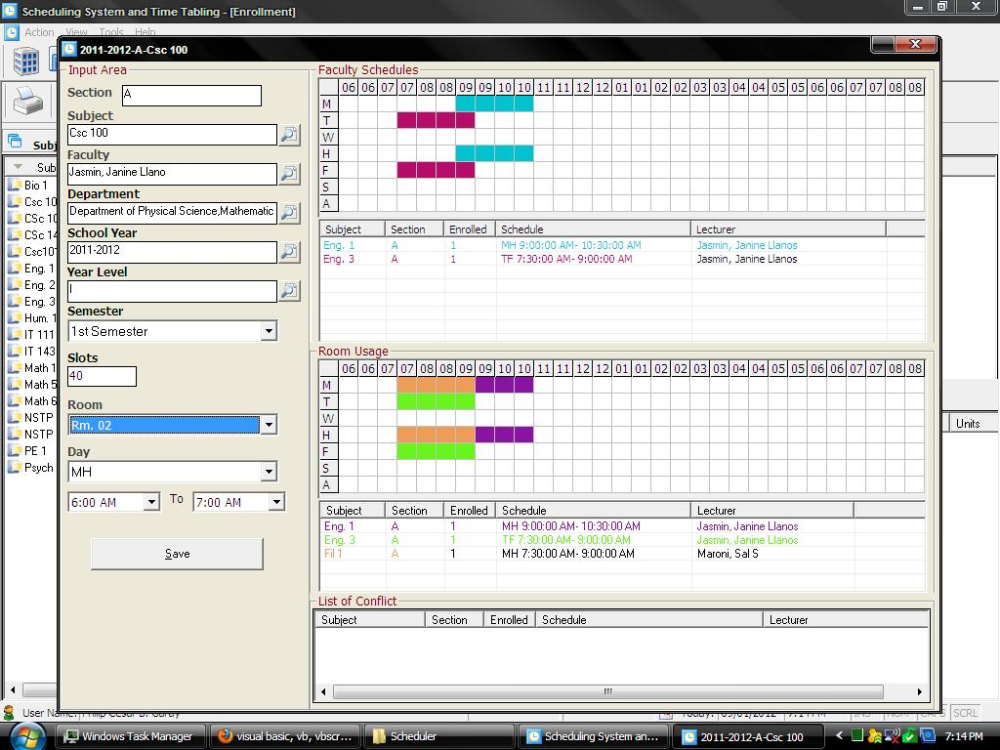



## Class Scheduling System

### Description

I would like to share here my Scheduling System, this system is only a part of my High School Enrollment System and my College Enrollment System that consist of 8 modules(registrar,grader,controller,scheduler,checker/assessor, collector/cashier,administrator, and the Web Transcript).

This system covers timetable for a school, high-school or university. It uses a fast and efficient timetabling algorithm.

- Defines school directory, faculty members, subjects, subject prerequisites, composites, class room, class section, and schedule template.

- Defines course prospectus and course master list.

- Manages course offerings, reservations, class scheduling, and faculty teaching load.

- Monitors classroom utilization.

- Forecasts subject demand.

please fell free to use and PLEASE PLEASE DONT FORGET TO COMMENT "Thanks" if you find my System useful to you... But if u take it for granted.. maybe I'll take some steps to remove this post I will mean it this time.... =)
 
### More Info
 

             |
---                |---
**Submitted On**   |2012-02-15 12:42:12
**By**             |[itachi\_philip](https://github.com/Planet-Source-Code/PSCIndex/blob/master/ByAuthor/itachi-philip.md)
**Level**          |Intermediate
**User Rating**    |5.0 (45 globes from 9 users)
**Compatibility**  |VB 6\.0, VBA MS Access
**Category**       |[Complete Applications](https://github.com/Planet-Source-Code/PSCIndex/blob/master/ByCategory/complete-applications__1-27.md)
**World**          |[Visual Basic](https://github.com/Planet-Source-Code/PSCIndex/blob/master/ByWorld/visual-basic.md)
**Archive File**   |[Class\_Sche222099322012\.zip](https://github.com/Planet-Source-Code/itachi-philip-class-scheduling-system__1-74238/archive/master.zip)

